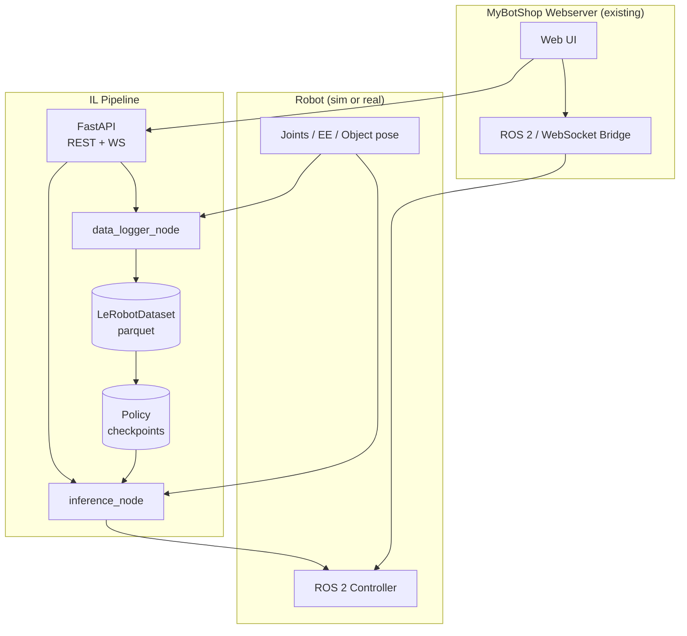
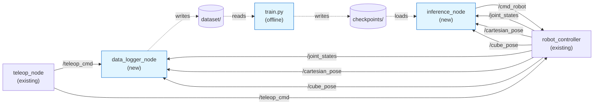

# Architecture

## System view

How the IL pipeline plugs into the existing MyBotShop webserver platform.

The IL pipeline is a sibling subsystem: same ROS 2 interfaces, separate FastAPI surface that the existing UI calls, never modifies the platform's core code.

## ROS 2 nodes and topics

Solid arrows are ROS 2 topics. Dashed arrows are filesystem reads/writes. The `inference_node` publishes to the same `/cmd_robot` topic the human teleoperator drives, so the deployed policy is a drop-in replacement for the teleop stream.

## Node summary

| Node | Subscribes | Publishes / Services |
|---|---|---|
| `data_logger_node` | `/joint_states`, `/cartesian_pose`, `/cube_pose`, `/teleop_cmd` | `~/start_episode` (`StartEpisode.srv`), `~/stop_episode` (`StopEpisode.srv`) |
| `inference_node` | `/joint_states`, `/cartesian_pose`, `/cube_pose` | `/cmd_robot` (`Twist`), `~/load_policy` (`LoadPolicy.srv`), `~/start` / `~/stop` (`Trigger`) |
| `pybullet_robot_node` (sim stand-in) | `/cmd_robot` | `/joint_states`, `/cartesian_pose`, `/cube_pose`, `/task_status`, `~/reset` |

The simulator and a real robot driver expose the same topic contract — switching from PyBullet to the MyBotShop platform on real hardware is a topic-remap, not a code change.
