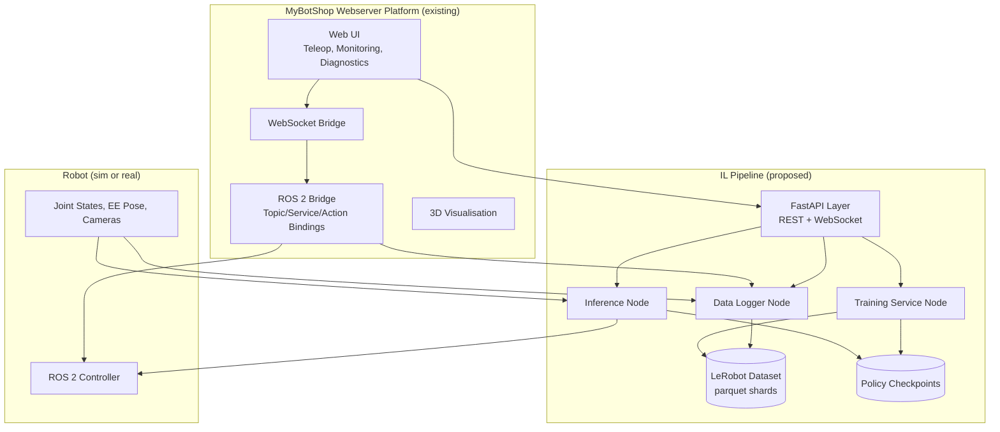
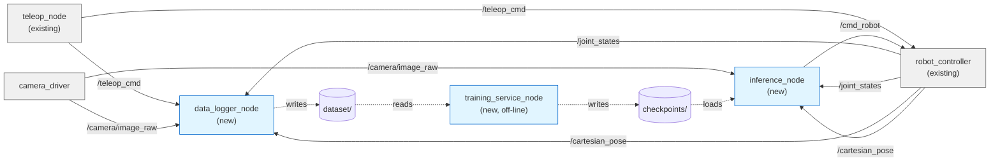
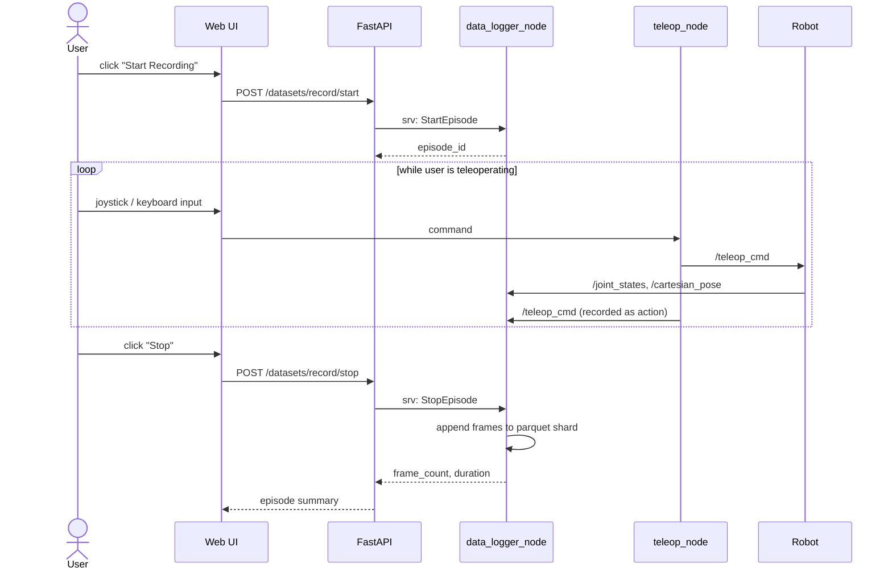
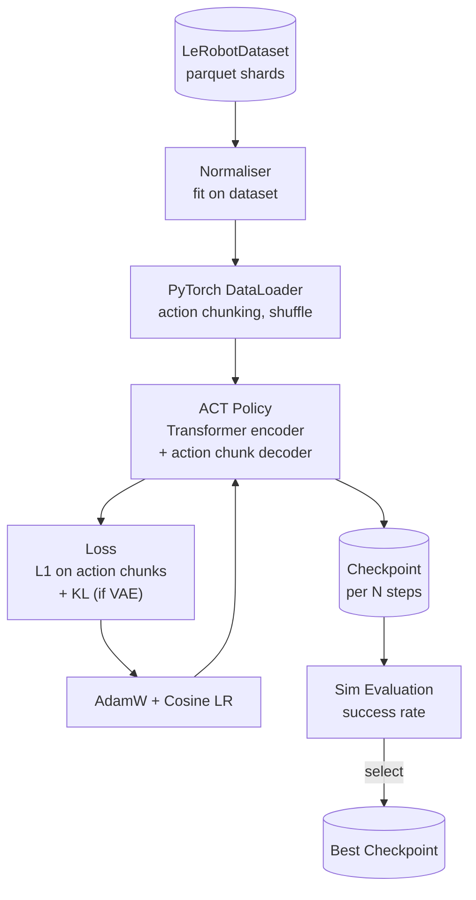
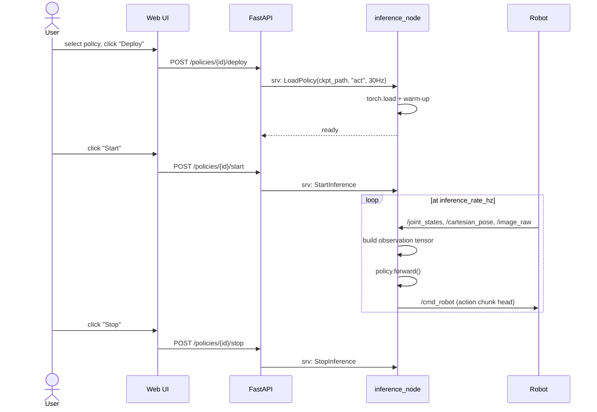
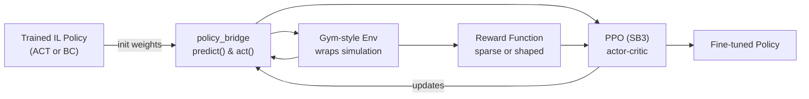

# Architecture Diagrams

All diagrams use Mermaid. They render natively on GitHub, GitLab, VS Code, and Foxglove docs.

---

## 1. System-Level Architecture

How the proposed components plug into the existing MyBotShop webserver platform.

The IL pipeline is a sibling subsystem to the existing platform: it speaks the same ROS 2 interfaces, exposes its own web layer that the existing UI can call, and never modifies the platform's core code.

---

## 2. ROS 2 Node Graph

The runtime topology of nodes, topics, and services.

Solid arrows are ROS 2 topics; dashed arrows are filesystem reads/writes.

---

## 3. Data Collection Flow

What happens when a user records a demonstration through the webserver UI.

---

## 4. Training Pipeline

How a logged dataset becomes a deployed policy.

---

## 5. Inference Flow

What happens when a trained policy is deployed.

ACT predicts chunks of `k` future actions per forward pass; the inference node executes the first action and re-predicts each cycle, or executes the full chunk with temporal ensembling — both modes are supported.

---

## 6. Optional RL Fine-Tuning Loop

How the IL policy is extended into an RL fine-tuning stage. This component carries over my thesis work on PPO directly.

The `policy_bridge` abstraction keeps IL and RL training decoupled from the deployment node — the same trained network can be loaded by `inference_node` regardless of which stage produced it.
