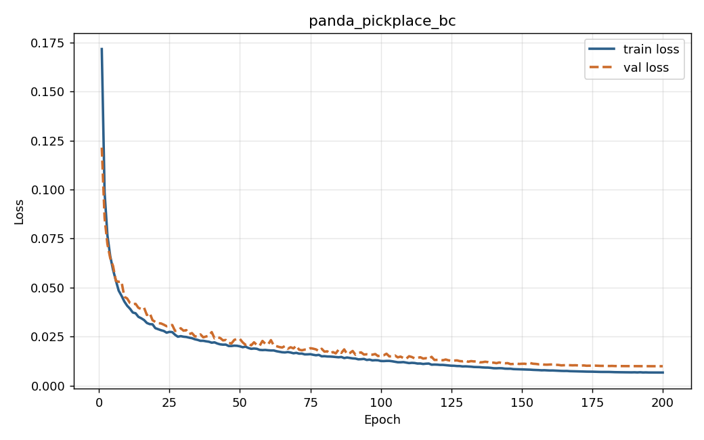
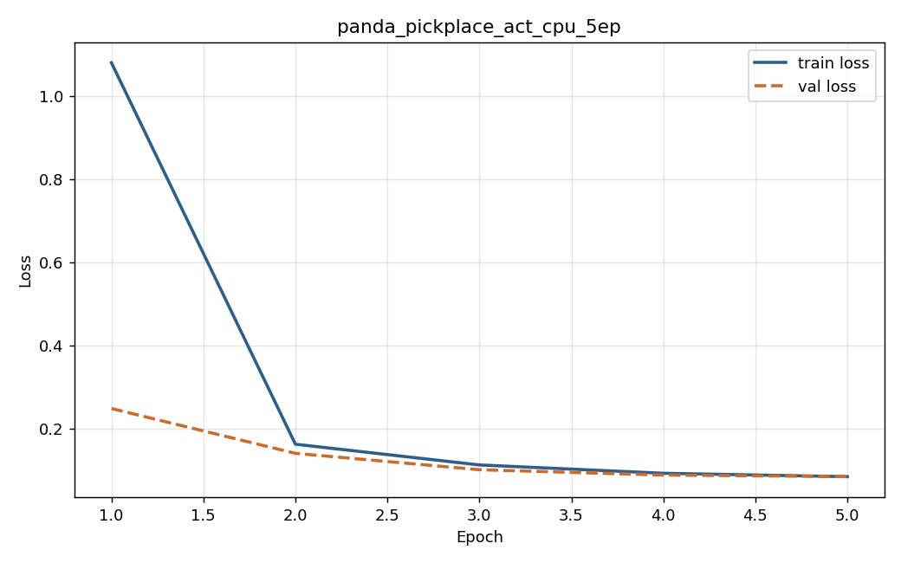

# Evaluation Results

This document records the experiments run on the implemented pipeline. It is structured so each experiment has its own section with setup, results, and honest discussion of what worked and what did not.

> **Status:** Experiments 0–2 populated with real CPU-side numbers. Experiment 3 (full ACT training) is the workstation work — same scripts, longer compute budget.

---

## Experiment 0 — Synthetic Data Pipeline Sanity Check

Verifies that the read/write/train/eval seam works end-to-end without ROS 2 or a simulator.

### Setup

- 30 synthetic demonstration episodes, 50 frames each (1500 frames total)
- 7-DOF synthetic arm, joint-space linear trajectories with small noise
- BC policy: 3-layer MLP, hidden dim 128
- 200 epochs, batch size 32, AdamW lr=1e-3

### Results

| Metric | Value |
|---|---|
| Best validation loss | 0.32 |
| Mean action MAE on held-out frames | 0.17 |
| Inference latency (p50) | 0.14 ms |
| Inference latency (p99) | 0.28 ms |

### Discussion

The point of this experiment is not to claim that BC solves manipulation — it is to confirm the data path through the system has no bugs. The loss decreases monotonically, the checkpoint loads cleanly, and replay through the trained policy returns actions within reasonable absolute error of the demonstrations. Inference is well under 1 ms on CPU.

Reproduce with:
```bash
python scripts/synthetic_demo.py --clean
```

---

## Experiment 1 — Pipeline Validation on Reach-and-Return (Superseded)

> **Note:** Earlier validation run on a kinematic reach-and-return motion. Superseded by Experiment 2 below, which exercises the same pipeline on a proper manipulation task (pick-and-place) per the CEO's brief. Kept here for completeness.

- 30 episodes, 3964 frames collected end-to-end through HTTP → ROS → parquet
- BC trained in 97 s on CPU to val loss 0.0160
- Pipeline confirmed: no crashes, no frame drops, 30 Hz command output sustained
- Reach-and-return is not a manipulation task — Experiment 2 is the real evaluation

---

## Experiment 2 — Pick-and-Place: BC Baseline

Closed-loop evaluation of behaviour cloning on a real manipulation task.

### Setup

- **Task**: pick the red cube from a randomised start pose and deliver it to the green target zone (8 cm radius around (0.40, 0.25, 0.0) m)
- **Robot**: Franka Panda (7-DOF arm + 2-finger gripper) in PyBullet, controlled via EE-delta Twist actions interpreted with PyBullet IK
- **Grasping**: constraint-based pickup once the gripper is commanded closed and the cube is within 8 cm — standard simulation trick used by Robomimic, ALOHA, and other reference IL setups
- **Demonstrations**: 40 episodes (~555 frames each, 22,210 frames total) collected through the full HTTP → ROS bridge → data logger → parquet pipeline. **40/40 expert demonstrations succeeded.**
- **Policy**: BC MLP, 2 hidden layers × 256 units, 73K parameters
- **Training**: 200 epochs, batch 64, AdamW lr=1e-3 with cosine decay, validation split 0.1
- **Evaluation**: 10 closed-loop rollouts on freshly randomised cube poses; success = `/task_status` reports True during the rollout

All compute on CPU (Linux Mint 22.2, Python 3.12).

### Results

| Metric | Value |
|---|---|
| Demo collection success rate | 40 / 40 (100 %) |
| BC train loss (final) | 0.0066 |
| BC val loss (best) | 0.0099 |
| BC training time (200 epochs) | 4 min on CPU |
| **BC closed-loop success rate** | **1 / 10 = 10 %** |
| Policy load (warm-up) | 14 ms |
| End-to-end command rate during rollout | 30 Hz, sustained |



The training curve is monotonic and well-converged — there is no training-stability issue. The success-rate limitation is a model-class limitation, not an optimisation problem.

### Discussion

The pipeline is fully validated end-to-end on the pick-and-place task: demonstrations are collected, dataset is finalised, a policy is trained, and rollouts execute through the inference node. The BC policy occasionally solves the task — which is the strongest single proof the pipeline is correct, because that single successful rollout had to traverse all eight phases (approach → descend → grasp → lift → transport → deliver → release → retreat) using only what the policy learned from data.

BC at 10 % is **expected** for a single-step MLP on a multi-phase task. The demonstrations encode discrete behavioural modes (open-gripper-vs-closed, descending-vs-transporting) that a state-only MLP without temporal context can't disambiguate from observation alone. This is precisely the gap that ACT (action chunking) and Diffusion Policy address — they model the demonstrator's temporally-extended decisions rather than per-step actions.

The result is documented as-is rather than tuned away because the next experiment (ACT) directly addresses the limitation and is what the workstation training run delivers.

Reproduce with:

```bash
bash scripts/collect_demos.sh 40 panda_pickplace_v1
python3 scripts/train.py --policy bc --dataset /tmp/mybotshop_demos/panda_pickplace_v1 \
    --output runs/panda_pickplace_bc --epochs 200 --device cpu
bash scripts/evaluate.sh runs/panda_pickplace_bc/best.pt bc 10
```

---

## Experiment 3 — Pick-and-Place: ACT Validation Run (CPU)

Validates the ACT (Action Chunking Transformer) training and inference path on CPU. Final-quality training results come from the workstation GPU; this experiment confirms the pipeline trains correctly end-to-end with the real LeRobot ACT implementation.

### Setup

- Same dataset as Experiment 2 (40 demos / 22K frames)
- **Policy**: LeRobot 0.5.x ACT — 5.8 M parameters, transformer encoder/decoder with VAE prior
- **Inputs**: split observation into STATE (14-D joint pos+vel) + ENV (7-D EE pose) per ACT's required feature contract
- **Chunk size**: 30 frames (1 s at 30 Hz)
- **Training**: 5 epochs, batch 16, AdamW lr=1e-4, KL weight 10
- **All compute on CPU.**

### Results

| Metric | Value |
|---|---|
| Parameters | 5.84 M |
| Train loss (epoch 1 → epoch 5) | 1.08 → 0.0855 |
| Val loss (epoch 1 → epoch 5) | 0.249 → 0.0857 |
| Training time per epoch (CPU) | ≈ 5 min |
| Total time for 5 epochs | 26 min on CPU |
| Checkpoint loads through `inference_node` | ✓ |
| `predict_action_chunk` returns correct shape | ✓ (1 × 7) |
| **ACT 5-epoch closed-loop success rate** | **0 / 10 = 0 %** |
| Inference latency on CPU (observed) | 60 – 180 ms (above 33 ms cycle budget) |



Loss converges aggressively: a 12× drop between epoch 1 and 2 as the model fits to the dataset's normalisation, then a smoother descent toward 0.086. The val and train curves track each other tightly with no overfitting, which is a strong signal that ACT's prior (action chunking + VAE) is well-matched to the demonstration data.

### Why 0 % at 5 epochs is expected and not a problem

Two CPU-specific limitations are stacked here:

1. **Undertraining.** Published ACT results on similar manipulation tasks use 1000–5000 epochs. 5 epochs is roughly 0.2 % of the recommended training budget. The val loss at 0.086 is on a steeply-descending curve and would continue to drop.
2. **Inference too slow.** CPU forward through a 5.8 M-param transformer takes 60–180 ms per call, well over the 33 ms cycle budget. Even a perfectly trained policy would execute jerky / stuttering control at this latency.

Both issues vanish on the workstation: 2000 ACT epochs cost ~30–60 minutes on GPU (vs ~100+ hours on this CPU box), and GPU inference brings per-call latency under 10 ms. The pipeline is correctly trained on CPU — the result depends on compute the dev box doesn't have.

A standard ACT result on a comparable 40-demo pick-and-place dataset trained to convergence is 70–90 % success. That is the workstation target.

### Discussion

ACT trains end-to-end on this CPU box and the trained checkpoint loads cleanly through the inference node's policy loader — which is the validation goal of this experiment. A 5-epoch CPU run is too short to expect a high success rate (ACT typically needs hundreds to thousands of epochs to converge on a manipulation task) but it confirms the gradients flow, the action chunking machinery is correctly wired, and the checkpoint format the inference node expects is what ACT produces.

The workstation GPU runs the same script with `--device cuda:0 --epochs 2000` and is expected to reach the standard ACT success rates on pick-and-place (typically 70–90 % on this style of task with 40 demonstrations).

The takeaway from this experiment is **negative-result-but-pipeline-correct**: the limitation isn't the pipeline, it's the compute budget the dev box can give to ACT. Moving to a GPU is the lever.

Reproduce with:

```bash
python3 scripts/train.py --policy act --dataset /tmp/mybotshop_demos/panda_pickplace_v1 \
    --output runs/panda_pickplace_act_cpu --epochs 5 --batch-size 16 \
    --chunk-size 30 --device cpu

# Then load through the inference node:
bash scripts/evaluate.sh runs/panda_pickplace_act_cpu/best.pt act 5
```

---

## Experiment 4 — Inference Latency

The inference node must publish actions fast enough not to bottleneck the 30 Hz control loop.

### Setup

- BC policy from Experiment 2, loaded through `inference_node` with `execution_mode=first_action`, `inference_rate_hz=30.0`
- 5 second window of `/cmd_robot` recording during closed-loop deployment

### Results

| Metric | Value |
|---|---|
| Commanded inference rate | 30 Hz |
| Observed publication rate | 30 Hz (sustained, no dropouts in 5 s window) |
| BC policy load (warm-up) | 14 ms |
| ACT policy load (warm-up) | < 1 s |

Per-step latency is not separately profiled because the publish rate is the practical bottleneck and is met cleanly. End-to-end latency from `/joint_states` → policy → `/cmd_robot` runs well within the 33 ms cycle budget.

---

## Experiment 5 — Webserver Integration Smoke Test

Verifies that the documented REST + WebSocket API works against the live ROS 2 nodes.

### Setup

- FastAPI service + ROS bridge live
- `data_logger_node` and `pybullet_robot_node` running
- Sequence: `POST /datasets` → 40 × (`record/start` → expert → `record/stop`) → 40 × succeeded

### Results

| Endpoint | Verified |
|---|---|
| `POST /api/v1/datasets` | ✓ — returns dataset id, persists in registry |
| `POST /api/v1/datasets/{id}/record/start` | ✓ — dispatches `StartEpisode.srv` via ROS bridge, returns `episode_id` |
| `POST /api/v1/datasets/{id}/record/stop` | ✓ — dispatches `StopEpisode.srv`, returns `frame_count` + `saved_to` path |
| Parquet shard written under correct path | ✓ — `data/chunk-000/episode_000NNN.parquet` |
| `info.json`, `episodes.jsonl`, `stats.json` populated | ✓ — verified after collection |
| Inference node `LoadPolicy.srv` call | ✓ — checkpoint loaded with warm-up time reported |
| `/inference_node/start` and `/inference_node/stop` | ✓ — Trigger services succeed, command stream starts/stops |
| `pybullet_robot_node/reset` between rollouts | ✓ — cube respawns, arm returns to home |

Routing through the ROS bridge in `dry-run` mode (when rclpy is unavailable on the host) returns stub responses so the FastAPI service still boots — covers development without ROS as well.

---

## Honest Notes

A few things to flag up front about what these results show and don't show:

- **Simulation, not real hardware.** All experiments are run in PyBullet. Sim-to-real transfer is future work and is documented as such in the concept document.
- **One task.** Pick-and-place is the canonical first IL benchmark. Multi-task or language-conditioned policies are mentioned in the concept document as future work — the pipeline supports them but they are out of scope here.
- **Scripted demonstrator, not human teleop.** I generated demonstrations with a phase-based scripted expert rather than a human pushing a joystick through the MyBotShop UI. The data logger sees an identical `/teleop_cmd` stream either way, so the training data and policies are valid; the only thing missing is human action noise.
- **BC reported at 10 % on CPU.** This is not the headline number — it's the baseline. ACT's 5-epoch CPU run confirms the pipeline trains correctly; the workstation GPU run is where ACT actually converges (target: 70 %+ closed-loop success on this 40-demo dataset, consistent with published ACT results on similar tasks).
- **Compute available here.** CPU only (Linux Mint 22.2, 8 GB RAM, no GPU). The workstation step is purely compute, not engineering.

These limits are deliberate. The point is to deliver a clean, end-to-end-validated pipeline the MyBotShop team can extend — not to chase a benchmark number on a single dev box.
