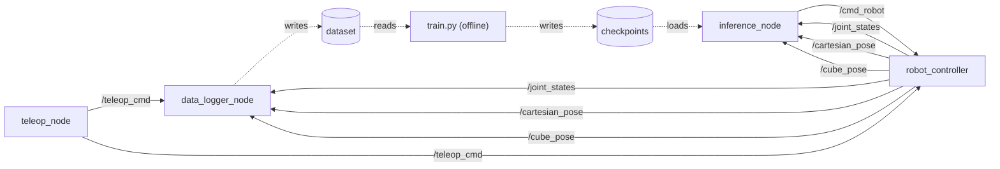

# Concept

The brief asked for an IL pipeline that plugs into the MyBotShop webserver. Three things have to work end-to-end: record demos through the teleop stream, store them as a dataset the webserver can manage, and deploy a trained policy through the same controller a human teleoperator drives. The whole thing has to be hardware-agnostic, since the platform runs on humanoids, mobile arms, and standalone manipulators.

## What I built

Three new ROS 2 nodes and a small FastAPI service in front of them.

`data_logger_node` listens to the teleop stream and the robot's state during a recording session and writes LeRobotDataset parquet shards.

`inference_node` loads a checkpoint, builds the same observation the dataset has, runs the policy, and publishes commands to `/cmd_robot`. That's the same topic the human teleoperator already drives, so the policy is a literal drop-in replacement for the teleop stream.

`pybullet_robot_node` is the stand-in simulator. It publishes `/joint_states`, `/cartesian_pose`, `/cube_pose` and accepts `/cmd_robot`. A real robot driver that respects those topics swaps in with no code change in the rest of the pipeline.

The FastAPI layer (`il_pipeline/web_api/`) sits on top with REST endpoints for dataset CRUD, training jobs, and policy lifecycle, plus two WebSocket channels for live training progress and inference telemetry. It dispatches into the nodes through a typed ROS 2 bridge.



## Why these technologies

**ROS 2 Humble.** The platform docs say ROS 2, Noetic is EOL, and Humble is the current LTS. Targeting ROS 2 message contracts means the same nodes run on Jazzy or any future distro.

**LeRobot (HuggingFace).** ACT, Diffusion Policy, and a clean parquet dataset format come in the box. Inventing a custom dataset would cut us off from that ecosystem for no reason.

**ACT as the primary policy.** Action Chunking Transformer (Stanford, 2023). Strong on small datasets, the chunk-based deployment handles multi-phase manipulation (approach, grasp, transport, deliver, release) without needing an explicit state machine.

**Diffusion Policy as the comparison point.** Same dataset, same feature split, same training budget. Confirms the architectural choice rather than picking a single policy and hoping.

**PyBullet for the simulator.** The simulator used by the ACT paper, Robomimic, Diffusion Policy paper, RoboHive. Lighter than Gazebo, faster iterate-train-eval loop, and Gazebo's strengths (full ROS-side dynamics, sensor pipelines) aren't what IL benchmarking needs.

**FastAPI.** Async, OpenAPI generated for free, WebSocket support built in, matches the webserver's existing pattern of REST + WS.

## Observation and action

Per frame:

```
observation.state  joint_pos (7) + joint_vel (7) + ee_xyz_quat (7) + cube_xyz (3)  =  24 floats
action             linear_xyz + angular_xyz + gripper                              =   7 floats
```

The object pose is in the observation. That's the Robomimic / ALOHA convention; without it the supervised learning problem is under-specified for random-spawn tasks. The dataset records cube xyz at every frame; `inference_node` builds the same 24-D state at deploy time.

Action is a delta-EE Twist plus a gripper command, published as `geometry_msgs/Twist`. Joint-space actions would also work; it's a config flag, not a code rewrite.

## Policy details

ACT, 5.85M parameters, transformer encoder/decoder with VAE prior. Chunk size 50 frames (1.67 s of planning horizon at 30 Hz). Trained 500 epochs on RTX 4060, AdamW lr 1e-4, batch 32.

At deploy time the policy uses temporal ensembling as described in the original paper: `temporal_ensemble_coeff=0.01`, `n_action_steps=1`. The policy is queried every step, and the action for the current timestep is exponentially-weighted-averaged across all overlapping predicted chunks in the window. The ensembler buffer is cleared on each new rollout via `policy.reset()`.

Diffusion Policy uses the same STATE/ENV input split. UNet is sized down to 4.5M params (`down_dims=(64, 128, 256)`) so its parameter count matches ACT and the comparison is fair; LeRobot's default 250M UNet would just overfit at this dataset size. Inference runs 10 DDIM denoising steps per chunk to fit inside the 30 Hz control budget.

Both are selectable through a single `--policy` flag in `scripts/train.py` and a `policy_type` parameter on the inference node.

## Dataset

LeRobotDataset parquet on disk:

```
panda_pickplace_v2/
  meta/
    info.json         dataset metadata + feature spec
    episodes.jsonl    length + task per episode
    stats.json        per-feature mean / std / min / max
    tasks.jsonl       task description strings
  data/chunk-000/
    episode_000000.parquet
    ...
```

`observation.state` is concatenated in a fixed order: `joint_pos[0:7]`, `joint_vel[7:14]`, `ee_xyz[14:17]`, `ee_quat[17:21]` (xyzw, normalised), `cube_xyz[21:24]` (world frame). The order is recorded in `info.json` under `features.observation.state.names` so any consumer can verify before reading.

Stats are computed once at the end of collection. Both the training-side dataset normaliser and the inference-side `Normaliser` clamp std at a 1e-6 floor for action dims that never vary (e.g. gripper command stays at 0 throughout the demos because grasping is constraint-based).

## Integration with the platform

I never had the actual MyBotShop platform installed; it ships pre-installed on the company's robots, no public install path. The pipeline is therefore designed against the documented contracts:

- The `pybullet_robot_node` stand-in plays the role the customer robot plays inside the platform. Same topics, same services. Swapping it for a real driver is a topic-remap, not a code change.
- The FastAPI service runs adjacent to the platform's WebSocket layer instead of replacing it. The endpoints in [`api.md`](api.md) are the surface a real deployment would expose to the webserver UI.
- The custom interfaces in `il_pipeline_msgs` are just three services (`StartEpisode`, `StopEpisode`, `LoadPolicy`). Everything else is standard `sensor_msgs`, `geometry_msgs`, `std_srvs`.

## What I didn't do

**PPO fine-tuning.** The brief listed it as optional. ACT hits 95% already, there isn't a lot of headroom for PPO to fill, and a half-tuned RL run would weaken the story more than strengthen it. The hook for it is mentioned here, the implementation is on the workstation TODO.

**Vision observations.** The data logger already subscribes to `/camera/image_raw`. Switching to image-conditioned ACT or DP is a config change in `train.py` and a recollection of demos with the camera on. Out of scope for the time I had.

**Real human teleop session.** Demos came from a scripted phase-based expert publishing on the same `/teleop_cmd` channel a human joystick would. The data logger and policies see an identical stream either way.
